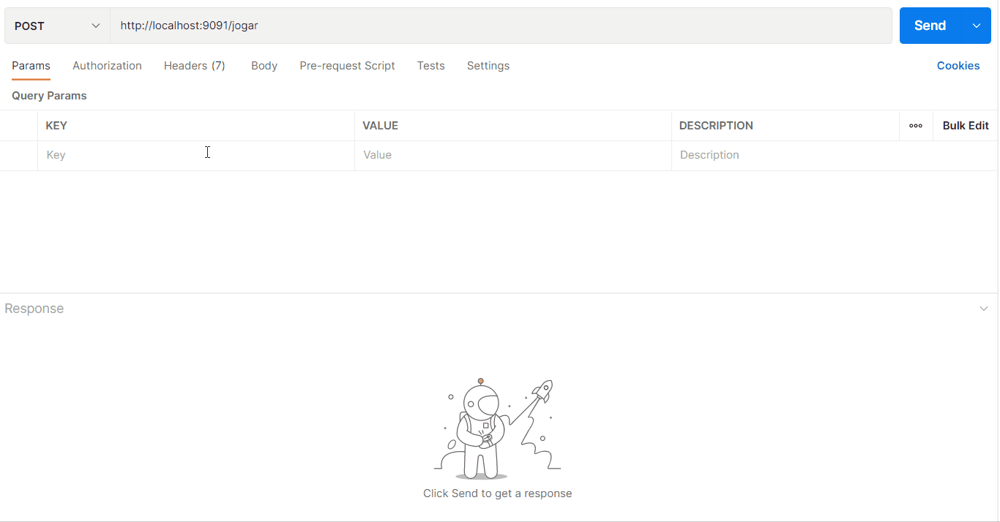

# API Jokenpô - CEO Gen 

Este é um projeto de API de jokenpô (jogo de pedra, papel, tesoura) que o usuário joga contra as escolhas aleatórias do computador. É possível adicionar e listar os jogadores, assim como as escolhas. Além disso, pode-se deletar um jogador específico da base de dados e verificar o ranking de jogadores.

## 🖥️ Tecnologias

Ferramentas utilizadas na construção do projeto:

- [Node.js](https://nodejs.org/en/)
- [MySQL](https://www.mysql.com/)
- [Git](https://git-scm.com/)
- [Postman](https://www.postman.com/)
- [VSCode](https://code.visualstudio.com/)

## ⚙️ Execução do Projeto

```powershell
# Clone este repositório
git clone https://github.com/RafaelStutz/ApiJokenpo

# Acesse a pasta do projeto no terminal
cd ApiJokenpo

# Instale as dependências
npm install 

# Execute o projeto
npm start

# O servidor iniciará na porta 9091 - acesse <http://localhost:9091>
```

## 🎮 Como jogar

No Postman, com o verbo http 'post' e na rota '/jogar' o usuário deve inserir o nome do jogador e sua escolha (pedra, papel ou tesoura). 
Dessa forma, receberá o retorno se venceu, empatou ou perdeu o jogo contra o computador.

<h1 align="center">
  
</h1>

## 📁 Pastas e Arquivos

- O arquivo index.js coloca nossa API para rodar no servidor.
- Config: o arquivo customExpress.js faz alterações no express antes de executá-lo.
- Infraestrutura: o arquivo conexao.js é responsável pela conexão com o banco de dados. O arquivo tabelas.js é responsável pela criação das tabelas.
- Controllers: o arquivo rotas.js é o responsável pelas rotas.
- Models: no arquivo escolhas.js são estabelecidos diversos métodos da classe Escolhas, a qual é utilizada em outros módulos. No arquivo jogadores.js são estabelecidos diversos métodos da classe Jogadores, a qual é utilizada em outros módulos.

## 😄 Agradecimento

Agradeço a squad Sharknado, ao Maik, ao Henrique e à Rayelly por toda ajuda!

---
Made by Rafael Stutz 🤙 https://github.com/RafaelStutz
